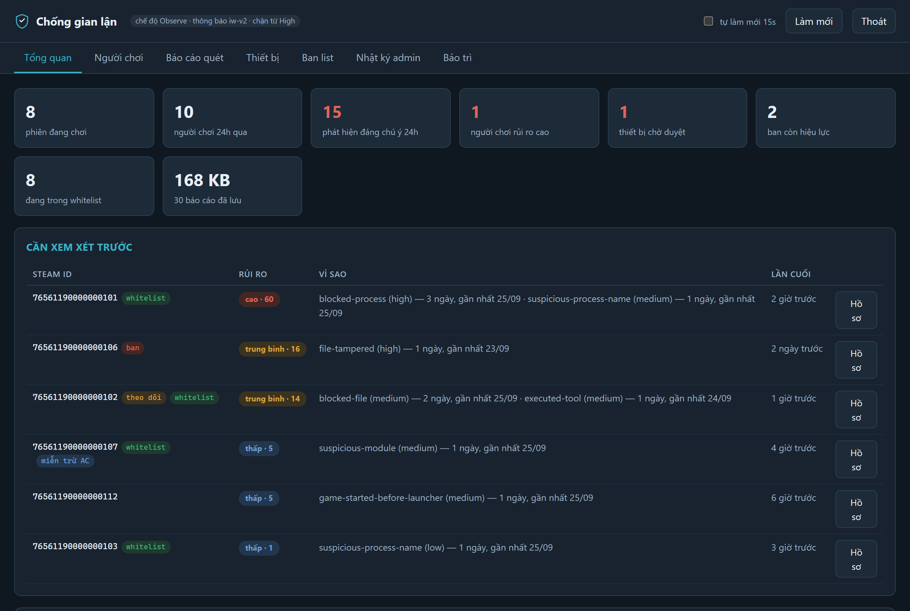
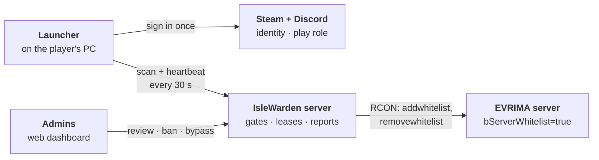
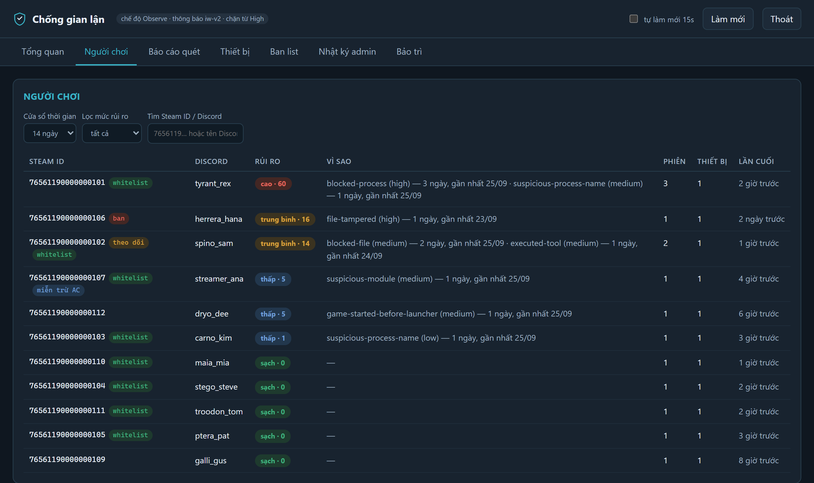
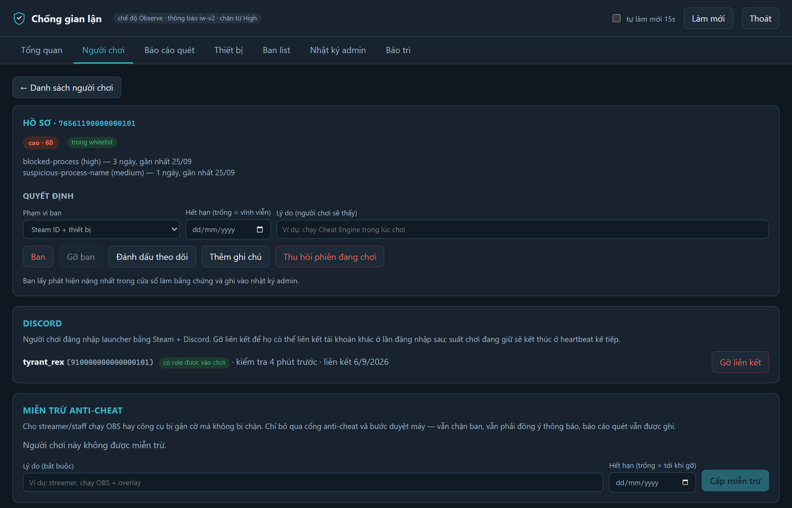

<div align="center">


# IsleWarden

**Opt-in anti-cheat and access control for community-run _The Isle: EVRIMA_ servers**

[](launcher)
[](server)
[](dashboard)
[](LICENSE)


**[Admin guide](docs/ADMIN-GUIDE.md)** · [Full reference](docs/REFERENCE.md) · [Server](server/README.md) · [Dashboard](dashboard/README.md)

</div>

<br>



<p align="center"><sub>The admin dashboard, filled with made-up demo players. Its labels are in Vietnamese.</sub></p>

Players run a small Windows launcher before they join. They sign in with Steam and Discord, and only
members of your Discord server who hold the role you choose get in. The launcher checks their PC for
known cheat tools and reports to a server you host. That server decides who may join, puts them on
the game server's whitelist over RCON, keeps them there only while their launcher keeps checking in,
and gives your admins a web dashboard to review reports and issue bans.

> [!TIP]
> **Running the server, or building IsleWarden into your own setup?** Read the
> [admin guide](docs/ADMIN-GUIDE.md) first: what to set up, where things live in the code, and the
> rules that must not break.

> [!IMPORTANT]
> IsleWarden runs in user mode. It deters cheating and catches common tools, but it can't stop
> kernel-mode cheats or someone who fakes the launcher. Run it **alongside** the game's
> EasyAntiCheat, not instead of it. Use it only on servers you operate, and tell players exactly
> what it checks (see [Privacy and transparency](docs/REFERENCE.md#privacy-and-transparency)).

## Features

- **Steam + Discord sign-in, no invite codes.** Players log in once per PC. Only members who hold
  the Discord role you choose can play: give the role to let someone in, remove it to stop them.
- **The game's own whitelist, kept in sync.** With `bServerWhitelist=true`, EVRIMA only lets Steam
  IDs on its whitelist connect. IsleWarden adds a player over RCON while their launcher runs and
  checks in every 30 seconds, and removes them when it stops. An optional safety net reads who is
  online and kicks anyone in the game without a lease.
- **User-mode scanners.** Blocked processes and DLLs, game files checked against a baseline for each
  game build, known cheat-tool files by name, launch order, windows drawn over the game (ESP
  overlays), and optionally Windows' execution history.
- **Observe first, enforce later.** Findings are recorded and can alert your admins on Discord. They
  block players only in `enforce` mode, and only at or above the severity you choose.
- **Bans that stick.** A ban can cover the Steam ID, its PCs and their hardware IDs (stored hashed).
  A new PC that shares hardware with a banned account waits for an admin.
- **Admin dashboard.** A review queue ranked by risk, player profiles, scan reports, devices, bans,
  anti-cheat bypasses for streamers, and a log of every admin action.
- **Consent up front.** Players see exactly what is checked before the first scan. Nothing on their
  PC is ever changed, closed or deleted.

## How it works



1. **Log in once per PC.** `IsleWarden.Agent login` opens the browser for Steam, then Discord. The
   server links the two accounts, checks that the player holds the play role, and gives the launcher
   a device key.
2. **Join.** `IsleWarden.Agent play --launch` scans the PC and asks for a lease. The server checks
   the gates in order, **device → ban → Discord role → consent → anti-cheat**, and stops at the first
   one that blocks.
3. **Whitelist.** A granted lease adds the Steam ID to EVRIMA's built-in whitelist over RCON
   (`addwhitelist`). With `bServerWhitelist=true` in `Game.ini`, only Steam IDs on that list can
   connect.
4. **Heartbeat.** Every 30 s the launcher rescans and renews the lease. A ban, a lost Discord role
   or, in `enforce` mode, a serious finding ends it.
5. **Leave.** Closing the launcher releases the lease at once; if heartbeats just stop, it expires
   after 75 s. When a player's last lease ends, IsleWarden takes their Steam ID off the whitelist
   (`removewhitelist`).

Every gate, block code and timing is in [How it works](docs/REFERENCE.md#how-it-works).

> [!NOTE]
> Three separate lists. The **Discord role** decides who may play at all. EVRIMA's **whitelist**
> decides who can connect right now, and IsleWarden keeps it in step with the leases. **Queue
> priority** is EVRIMA's `VIPs=` list in `Game.ini`; IsleWarden doesn't touch it.

## Screenshots

<table>
  <tr>
    <td width="50%" valign="top"></td>
    <td width="50%" valign="top"></td>
  </tr>
  <tr>
    <td align="center"><sub>Players, ranked by risk</sub></td>
    <td align="center"><sub>A player's profile</sub></td>
  </tr>
</table>

## Quick start

To try it on one Windows PC you need the .NET 10 SDK and Python 3.10+; no game server is needed.
From the repository root, in PowerShell:

```powershell
# Build and test the launcher and the server
dotnet test launcher\IsleWarden.slnx
python -m venv server\.venv
server\.venv\Scripts\pip install -r server\requirements-dev.txt
cd server; .venv\Scripts\python -m pytest

# Start the server (admin key iw-local-test; Discord check off; new PCs need approval)
.venv\Scripts\python -m islewarden_server --dev
```

Then, in a second window from the repository root:

```powershell
dotnet run --project launcher\IsleWarden.Agent -- login --server http://localhost:5088
# Approve this PC at http://localhost:5088/admin/ (Devices tab), then join:
dotnet run --project launcher\IsleWarden.Agent -- play
```

> [!CAUTION]
> `login` replaces the registration saved in `%LOCALAPPDATA%\IsleWarden\agent.json`. Don't run it
> on a PC whose real registration you need to keep.

To scan this PC without a server, run `Copy-Item config\policy.example.json policy.json`, then
`dotnet run --project launcher\IsleWarden.Agent -- scan policy.json --once`. Every step is explained
in [Quick start in detail](docs/REFERENCE.md#quick-start-in-detail).

## Repository layout

```text
IsleWarden/
├── launcher/                   Player launcher (C#, .NET 10), shipped to players
│   ├── IsleWarden.Agent/       Launcher console app (net10.0-windows)
│   ├── IsleWarden.Core/        Detection modules, policy model, wire protocol (net10.0)
│   ├── IsleWarden.Core.Tests/  xUnit: scanners, parsers, Prefetch reader, protocol
│   └── IsleWarden.slnx         Solution file
├── server/                     Server (Python 3.10+, FastAPI + SQLite) for your host
│   ├── islewarden_server/      The package; static/ has consent.html and the dashboard
│   ├── tests/                  pytest: gates, login, whitelist, RCON, dashboard, risk
│   └── tools/mock_rcon.py      Mock EVRIMA RCON server for manual testing
├── dashboard/                  Admin dashboard (React + Vite), built into server/
├── config/                     Example policies: a local scan's and the server's
├── docs/                       Admin guide, reference, images, older Vietnamese notes
└── build-release.ps1           Builds the release packages into dist/
```

Each top-level folder has its own toolchain: `dotnet` for the launcher, `pip` and `pytest` for the
server, `npm` for the dashboard. The launcher and the server share no code, only the HTTP protocol.

## Documentation

| Document | What's in it |
|---|---|
| [Admin guide](docs/ADMIN-GUIDE.md) | **Start here if you run the server:** setup checklist, decisions, code map, the rules that must not break |
| [Reference](docs/REFERENCE.md) | Everything in detail: access gates, launcher commands, detection modules, settings, policy, EVRIMA and Discord setup, deploying, the dashboard, the HTTP API, testing, privacy, security |
| [Server](server/README.md) | Installing and running the Python server, deploying it on Linux, its tests and module map |
| [Dashboard](dashboard/README.md) | Working on the dashboard |
| Older notes, in Vietnamese | [Design](docs/DESIGN.md) · [Server setup](docs/SERVER-SETUP.md) · [Real-server testing](docs/TEST-WITH-REAL-SERVER.md) · [Hardware bans](docs/HWID-BANNING.md) · [Roadmap](docs/ROADMAP.md). Where they disagree with the English docs, the English docs win. |

## Limitations

- **User mode only.** Kernel-mode cheats, DMA hardware and cheats running on another PC are out of
  reach.
- **The launcher can be imitated,** and nothing ties the game to the launcher's PC yet. Fixes for
  both are on the roadmap.
- **Removing a player from the whitelist blocks their next join;** whether it also kicks them hasn't
  been verified. The kick safety net uses RCON commands (`playerlist`, `kick`) that are unverified
  too, and if RCON breaks it kicks nobody. A whitelist pushed over RCON is lost when the game server
  restarts.
- **Heuristics produce false positives.** Start in `observe` mode and tune before you enforce.
- **The UI text is Vietnamese only.**

The full list is under [Limitations](docs/REFERENCE.md#limitations), and what comes next under
[Roadmap](docs/REFERENCE.md#roadmap).

## Status

Version 0.5.0, a working prototype. The scanners, launcher and server have automated tests and have
run end to end against a byte-accurate mock of EVRIMA's RCON protocol. The Steam + Discord login is
tested against fake Steam and Discord endpoints. Before relying on it, run the
[real-server test](docs/REFERENCE.md#level-2-a-real-evrima-server) on your own game server and
Discord application.

The code is original and uses publicly documented Windows, Steam and EVRIMA techniques.

## License

Released under the [MIT License](LICENSE).
