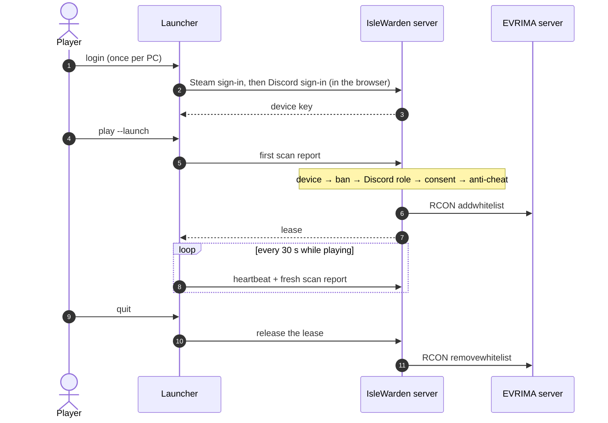

# IsleWarden reference

Everything the [README](../README.md) summarizes, in full. If you run the server, read the
[admin guide](ADMIN-GUIDE.md) first: it tells you which parts of this page you can't skip.

## Contents

- [How it works](#how-it-works)
- [Quick start in detail](#quick-start-in-detail)
- [The launcher (Agent)](#the-launcher-agent)
- [Detection modules](#detection-modules)
- [The server](#the-server)
- [Configuration](#configuration)
- [Connecting to an EVRIMA server](#connecting-to-an-evrima-server)
- [Deploying](#deploying)
- [Admin dashboard](#admin-dashboard)
- [HTTP API](#http-api)
- [Testing](#testing)
- [Privacy and transparency](#privacy-and-transparency)
- [Security notes](#security-notes)
- [Limitations](#limitations)
- [Roadmap](#roadmap)
- [Conventions for contributors](#conventions-for-contributors)

## How it works

EVRIMA gives server owners almost no way to inspect a connected player's PC. The practical answer
for community servers is a mandatory companion launcher: the launcher checks the PC and vouches for
it, and the server only whitelists players whose launcher is running and passing its checks.



### Lifecycle

1. **Log in once per PC.** The player runs `IsleWarden.Agent login`, accepts the disclosure, and
   signs in with Steam and then Discord in their browser. Steam proves which Steam ID they own.
   Discord proves they are in your Discord server and hold a required role: **giving someone the role
   in Discord is how you let them play**, and there are no invite codes. The launcher also sends the
   PC's hardware fingerprint. The server creates a device record, either auto-approved or held for an
   admin, and returns a secret device key. The launcher stores the key encrypted with Windows DPAPI;
   the server keeps only its hash.
2. **Join.** `IsleWarden.Agent play` fetches the current policy. If the disclosure has changed, the
   player must accept it again. The launcher then scans the PC and asks for a *play lease*. The
   server checks the [access gates](#access-gates) in order and stops at the first one that blocks.
3. **Whitelist.** Granting a lease adds the Steam ID to the game server's whitelist. With
   `bServerWhitelist=true` in `Game.ini`, only whitelisted players can connect.
4. **Heartbeat.** While the player is in game, the launcher rescans and sends a heartbeat every
   `HeartbeatSeconds` (default 30 s). Each heartbeat renews the lease. A new ban, a rejected device,
   a lost Discord role (re-checked every `RoleRecheckMinutes`, default 10) or a serious finding in
   `enforce` mode revokes the lease.
5. **Leave.** Quitting the launcher (Ctrl+C or closing its window) releases the lease at once. If
   heartbeats simply stop, `SessionSweeper` expires the lease after
   `HeartbeatSeconds × MissedHeartbeatGrace` (default 75 s). That grace period means a short network
   drop or a launcher restart doesn't cost the player their place. When a player's last active lease
   ends, their Steam ID is removed from the whitelist.

IsleWarden never modifies, closes or deletes anything on a player's PC. The only consequence of
failing a check is not getting on the whitelist, being taken off it, or being kicked from the game.

**Kick safety net (optional).** With `Whitelist.KickWithoutLease=true`, the server also reads the
game server's player list over RCON every `KickPollSeconds` (default 20 s) and kicks every Steam ID
that is online without an active lease:

- a player who has no lease, after `KickGraceSeconds` (default 60 s), which leaves time to start the
  launcher;
- a banned player at once, with the ban's wording;
- a player kicked in the last 10 minutes who came back without a lease at once;
- never a Steam ID in `ExemptSteamIds` (staff who play without the launcher).

This covers players whose lease ended while they were in the game, and it's the only gate if the game
server runs with `bServerWhitelist=false` (see [Whitelist on or off](#whitelist-on-or-off)). It fails
open: when the player list can't be read, nobody is kicked, and after three failed reads admins get a
Discord alert. Both RCON commands it uses, `playerlist` and `kick`, are unverified on a real server.

> [!NOTE]
> Removing a Steam ID from the whitelist reliably blocks the player's *next* join. It hasn't been
> verified whether EVRIMA also disconnects a player who is already in the server. See `KickOnRevoke`
> and `KickWithoutLease` under [Server settings](#server-settings).

### Access gates

| Order | Gate | Blocks when | Codes |
|---|---|---|---|
| 1 | Device | unknown device or wrong key · device rejected by an admin · device awaiting approval | `device-unknown` · `device-rejected` · `device-pending` |
| 2 | Ban | the Steam ID, the device, or one of its identifying hardware components is banned | `banned` |
| 3 | Discord | no Discord account is linked to the Steam ID · the account left your Discord server · it doesn't hold a required role | `discord-not-linked` · `discord-not-member` · `discord-role-missing` |
| 4 | Consent | the player hasn't accepted the current `disclosureVersion` | `consent-required` |
| 5 | Anti-cheat | `enforce` mode and a finding at or above `EnforceThreshold` | `anticheat-blocked` |
| — | Lease (after joining) | heartbeats lost past the grace period · revoked by an admin · released by the launcher · unknown lease | `lease-expired` · `lease-revoked` · `lease-released` · `lease-invalid` |

Every block includes:

- `label`: a sentence for the player.
- `detail`: specifics.
- `until`: when a timed ban ends.
- `supportCode`: a reference the player can quote to an admin. `R-123` means scan report 123 and
  `B-45` means ban entry 45.

Released codes never change (see `AccessCodes`), so tooling should act on the code, not on the
wording. Lease endings deliberately never reuse anti-cheat codes: a player dropped because of a bad
connection shouldn't be told they're suspected of cheating.

**Anti-cheat bypass.** Admins can grant a bypass to a single Steam ID, for example a streamer whose
capture software trips the scanner. A bypass relaxes only the anti-cheat gate and the
device-approval step. It never lifts a ban, a rejected device, the Discord role or the consent
requirement, and the player's reports are still recorded. The server looks the bypass up by Steam ID
on every request, so it can't be moved to another account. Setting `AllowAntiCheatBypass=false`
suspends every bypass at once, for example during a tournament, without deleting them.

### Observe and enforce

The policy's `mode` decides what findings do:

- **`observe`** (default): findings are stored, shown in the dashboard and sent to Discord, but they
  never block anyone.
- **`enforce`**: a finding at or above `EnforceThreshold` (default `high`) denies the join or revokes
  the lease.

Severities, from lowest to highest: `info < low < medium < high < critical`. A report counts as
*clean* when it has no finding at `low` or above. `info` findings are context (for example "Prefetch
isn't readable without admin rights"), not accusations.

Start in `observe`, watch the dashboard for false positives, then switch to `enforce`.

## Quick start in detail

Everything below runs on one Windows PC without a game server. Use PowerShell from the repository
root.

| To | You need |
|---|---|
| Build the launcher | .NET SDK 10 (`dotnet --version`) |
| Run the launcher | Windows 10 or 11, x64. The release build is self-contained, so players don't install .NET. |
| Run the server | Windows or Linux with Python 3.10 or newer. No .NET runtime is needed. |
| Change the dashboard | Node.js LTS with npm. The built dashboard is committed in `server/islewarden_server/static/admin`. |
| Use the `rcon` whitelist mode | An EVRIMA dedicated server with RCON enabled. Nothing else needs a game server. |

**1. Build and test**

```powershell
dotnet build launcher\IsleWarden.slnx
dotnet test launcher\IsleWarden.slnx
python -m venv server\.venv
server\.venv\Scripts\pip install -r server\requirements-dev.txt
cd server; .venv\Scripts\python -m pytest; cd ..
```

The first two lines build and test the launcher and its detection library; the rest sets up and tests the
server.

**2. Scan this PC without a server**

```powershell
Copy-Item config\policy.example.json policy.json
dotnet run --project launcher\IsleWarden.Agent -- scan policy.json --once
```

This prints a JSON scan report. With `--once`, the exit code is `0` (clean), `1` (findings) or
`2` (the policy couldn't be read). Without `--once`, the scan repeats every `intervalSeconds`.

**3. Start the server**

In a second PowerShell window:

```powershell
cd server
.venv\Scripts\python -m islewarden_server --dev
```

The server listens on http://localhost:5088. `--dev` also loads `appsettings.Development.json`, which
sets the admin key to `iw-local-test`, makes new devices wait for approval, and turns the Discord
requirement off so you can log in with Steam alone. Those values are for local use only. To try the
Discord role check locally, set `Discord:Required` to `true` and fill in the Discord keys (see
[Set up Discord login](#set-up-discord-login)).

**4. Log in from this PC**

```powershell
dotnet run --project launcher\IsleWarden.Agent -- login --server http://localhost:5088
```

Your browser opens the Steam sign-in page; after you sign in, the tab says the login succeeded and
the launcher saves its device key.

> [!CAUTION]
> `login` replaces any registration already saved on this PC in
> `%LOCALAPPDATA%\IsleWarden\agent.json`. Don't run it on a PC whose real registration you need to
> keep.

The device starts as *pending*. Approve it on the dashboard at http://localhost:5088/admin/ (sign in
with `iw-local-test`, **Devices** tab), or with the API (`GET /api/admin/devices` lists device IDs):

```powershell
$admin = @{ 'X-Admin-Key' = 'iw-local-test' }
Invoke-RestMethod -Method Post http://localhost:5088/api/admin/devices/<deviceId>/approve -Headers $admin
```

**5. Join**

```powershell
dotnet run --project launcher\IsleWarden.Agent -- play
```

The launcher prints the result of each gate, then sends a heartbeat every 30 seconds until you
press Ctrl+C. Add `--launch` to also start the game through Steam. The default whitelist mode is
`none`, so the server only logs what it would add to or remove from the game's whitelist.

**6. Look around.** The dashboard at http://localhost:5088/admin/ now shows the player, the device,
the lease and every scan report.

## The launcher (Agent)

`IsleWarden.Agent.exe` is a console app. Players run `login` once, then `play --launch` each time
they want to play.

| Command | What it does |
|---|---|
| `login [--server URL] [--yes]` | Shows the disclosure (`--yes` accepts it without a prompt), then opens the browser to sign in with Steam and Discord, and saves the device key the server issues. Exits `0` when logged in, `1` if declined or refused (for example no Discord role), `3` if the server is unreachable or the browser step takes over 10 minutes. |
| `play [--launch] [--yes] [--server URL]` | Consent, then scan, then request a lease, then optionally start the game, then send heartbeats until you quit |
| `scan [policy.json] [--once]` | Scans with a local policy file, without a server. Also the default when no command is given. |
| `baseline [--game-dir DIR] [--out FILE] [--build-id ID] [--include "*.exe;*.dll"] [--exclude "EasyAntiCheat"]` | Admin tool: hashes a clean game install into a baseline file for its build |
| `fingerprint [--raw]` | Prints this PC's hardware identifiers (masked unless `--raw`) and its device ID. Sends nothing. |

Exit codes of `play`:

| Code | Meaning |
|---|---|
| `0` | normal exit |
| `1` | consent declined, join denied, or lease revoked |
| `2` | this PC hasn't logged in yet |
| `3` | the server couldn't be reached, or the connection was lost for longer than the grace period |
| `4` | the device is awaiting approval |

- **Local state.** The launcher keeps its state in `%LOCALAPPDATA%\IsleWarden\agent.json`: the
  server URL, device ID, Steam ID and accepted disclosure version. The device key is stored there
  encrypted with DPAPI, so only the same Windows user can use it. While the player is in game, the
  current lease is stored there too, also DPAPI-protected.
- **Finding the game.** The launcher finds the install folder and build ID through Steam, using
  `steamAppId` (376210 for The Isle). For setups without Steam, set `gameDirectory` in the policy.
- **Restarts and network drops.** A launcher that restarts within the grace window resumes its
  saved lease instead of starting a new one. If a heartbeat fails, it retries every 5 seconds until
  the lease would expire.
- **Admin rights** aren't needed. Only the optional execution-history check requires them (see
  [Execution history](#execution-history-prefetch)).
- **Language.** Text shown to players and admins is in Vietnamese, the language of the community
  this was built for. Code, comments and this reference are in English.

## Detection modules

All scanners live in `IsleWarden.Core`, and the policy decides which of them run. `Scanner` runs
the enabled ones in a single pass and returns a `ScanReport`. Each finding has a code from
`FindingCodes`. Released codes are never renamed, because stored reports and tooling depend on them.

| Module | What it checks | Finding codes |
|---|---|---|
| `ProcessScanner` | Running processes against `blockedProcesses`. Matches by name (case-insensitive, `.exe` optional), and optionally only when the file's SHA-256 is also on the list, to avoid false positives on harmless programs with the same name. | `blocked-process` |
| `ProcessInventoryScanner` | Optionally sends the **names** of running processes (never paths, command lines or window titles) and flags names containing keywords such as `aimbot`. Keyword matches are heuristics and default to `low`. | `suspicious-process-name` |
| `ModuleScanner` | DLLs loaded in the game process: blocked names or hashes, or DLLs loaded from suspicious folders (`%TEMP%`, `\Downloads\`). EasyAntiCheat may refuse the read; that becomes an `info` finding. Off by default. | `blocked-module` · `suspicious-module` · `module-scan-unavailable` |
| `StartupOrderChecker` | The game was started before the launcher (5 s tolerance). | `game-started-before-launcher` |
| `FileIntegrityChecker` + `AuthenticodeVerifier` | `protectedFiles`: allowed SHA-256 hashes, and an Authenticode check through `WinVerifyTrust` (full chain and timestamp) with an optional expected signer. | `file-missing` · `file-unreadable` · `file-tampered` · `unsigned-file` · `invalid-signature` · `wrong-signer` · `signature-check-failed` |
| `BaselineChecker` + `BaselineBuilder` + `FileHashCache` | Compares the whole game folder with the baseline for the installed build: modified, missing and extra files (for example a dropped-in `.pak` or `.dll`). Hashes are cached by size and modification time. Each scan hashes at most `maxHashMegabytesPerScan` (512 MB), so large files are covered over several scans. | `file-tampered` · `file-missing` · `file-unreadable` · `unexpected-file` · `baseline-unavailable` · `baseline-outdated` · `baseline-pending` |
| `FileScanner` | Known cheat-tool files, matched by exact **name**, in chosen folders (Downloads, Desktop, Temp, the game folder), with depth, file-count and time limits. Names that don't match are never recorded. A file is opened only when its name matches and its rule lists SHA-256 hashes to confirm. Defaults to `medium`, because owning a tool doesn't prove using it. | `blocked-file` |
| `ExecutionHistoryScanner` + `PrefetchReader` | Windows Prefetch: listed tools that ran and were closed before the launcher started. Off by default and needs admin rights. See [Execution history](#execution-history-prefetch). | `executed-tool` · `suspicious-executed-name` · `execution-history-unavailable` · `execution-history-off` |
| `SteamLocator` + `VdfParser` | Finds the game's install folder and build ID from Steam's `libraryfolders.vdf` and app manifest. | `game-not-found` |
| `DeviceFingerprintCollector` + `WmiIdentifiers` | Hardware identifiers for device bans: MachineGuid, the primary MAC address, and the disk, baseboard and BIOS serials and CPU ID read through WMI. | — |
| `OverlayScanner` + `WindowSource` | Windows of other programs drawn over the game while it is in the foreground: topmost, layered or click-through windows (how ESP/wall-hack overlays are made), or windows hidden from screen capture. Legitimate overlays listed in `overlayScan.allowedProcesses` and Windows' own components are ignored. Defaults to `medium`. See [Overlay scan](#overlay-scan). | `foreign-overlay` · `overlay-scan-unavailable` |

A finding about a matched item can include that item's path (for example where a blocked tool
runs from), so an admin can verify it.

## The server

The server in `server/` is a FastAPI app on Python 3.10+ with SQLite from the standard library, in WAL
mode. It runs on Windows or Linux; [server/README.md](../server/README.md) covers installing and running
it. Its modules, in `server/islewarden_server/`:

| Module | Role |
|---|---|
| `login/` (`service.py`, `steam.py`, `discord_api.py`) | The login flow: Steam OpenID, Discord OAuth2, linking the two accounts, issuing the device key |
| `login/discord_gate.py` | The Discord role check at join and every `RoleRecheckMinutes` during play, cached per player; if Discord is unreachable it uses the last known result |
| `sessions.py` | Device records, the access gates, and granting, renewing, releasing, revoking and expiring leases |
| `sweeper.py` | Background thread. Every `HeartbeatSeconds / 2` it expires leases whose last heartbeat is older than the grace period. |
| `whitelist.py` + `rcon.py` | Mirrors the `whitelist` table to the game server in `none`, `rcon` or `file` mode. Game-server errors are logged and never block granting or revoking a lease. |
| `enforcer.py` | Optional background thread (`KickWithoutLease`). Every `KickPollSeconds` it reads the game's player list over RCON and kicks Steam IDs that are online without an active lease. If the list can't be read, it kicks nobody. |
| `policy.py` | Serves `server-policy.json` and reloads it when the file changes, keeping the last good version if the new one doesn't parse. Also serves baselines by build ID. |
| `discord.py` | Webhook alerts for findings at or above `Discord.MinSeverity`, joins blocked by a ban, revoked leases, lost heartbeats and new devices that need review |
| `dashboard.py` + `risk.py` | Dashboard queries and the per-player risk score |
| `crypto.py` | Random secrets, hashing, PKCE, constant-time comparison |
| `access.py` | The access gates' stable codes (`AccessCodes`, `LoginCodes`) and the wording players see |

**Database.** The server creates and migrates the database at `DatabasePath` on startup. Its
tables:

| Table | Holds |
|---|---|
| `devices` | registered PCs |
| `device_components` | hashed hardware identifiers |
| `discord_links` | the Discord account each Steam ID signed in with, and its last role check |
| `bans` | ban entries |
| `sessions` | play leases |
| `ac_bypass` | anti-cheat bypasses |
| `reports` | raw scan reports |
| `findings` | one row per finding, for search and statistics |
| `admin_actions` | the admin audit log |
| `ban_evidence` | reports and summaries attached to bans |
| `whitelist` | the whitelist the game server should have |

**Static pages:**

- `/consent.html`: the disclosure page for players, built from the live policy. Put its public URL
  in `ConsentUrl` and the launcher links to it.
- `/admin/`: the dashboard.
- `/health`: health check.

## Configuration

### Server settings

The server reads the `IsleWarden` section of `appsettings.json`. Any key can be overridden with an
environment variable: `IsleWarden__AdminKey`, `IsleWarden__Whitelist__Mode`, and so on.

| Key | Default | Meaning |
|---|---|---|
| `AdminKey` | none | **Required.** Admins send it in the `X-Admin-Key` header. Until it's set, every `/api/admin` endpoint returns 503. |
| `FingerprintPepper` | none | Secret key for hashing hardware identifiers (HMAC-SHA256). Set a long random value once and never change it: changing it breaks every existing hardware ban and match. |
| `DatabasePath` | `data/islewarden.db` | SQLite file, relative to the working directory |
| `PolicyPath` | `server-policy.json` | Policy served to launchers; reloaded automatically when edited |
| `BaselineDirectory` | `data/baselines` | Uploaded baselines, one `<buildId>.json` per game build |
| `ConsentUrl` | none | Public URL of the disclosure page, for example `https://ac.example.com/consent.html`. The launcher shows it. |
| `PublicUrl` | none | Base URL players' browsers reach the server at, for example `https://ac.example.com`. Steam and Discord send the browser back here after sign-in. Unset = taken from each request, which is fine locally but unreliable behind a reverse proxy. |
| `HeartbeatSeconds` | `30` | Heartbeat interval the server asks launchers to use |
| `MissedHeartbeatGrace` | `2.5` | How many heartbeat periods a lease survives without a heartbeat (30 × 2.5 = 75 s) |
| `AutoApproveDevices` | `true` | Approve new devices automatically. Even when `true`, an admin must review a device with no hardware fingerprint, or one that shares hardware with a banned account or with another Steam ID. |
| `AllowAntiCheatBypass` | `true` | Master switch for per-player anti-cheat bypasses |
| `EnforceThreshold` | `High` | Lowest severity that blocks in `enforce` mode |
| `Whitelist.Mode` | `none` | `none` (log only), `rcon` or `file` |
| `Whitelist.RconHost`, `RconPort`, `RconPassword` | none, `8888`, none | EVRIMA RCON connection for `rcon` mode |
| `Whitelist.FilePath` | none | Output for `file` mode: one Steam ID per line, written atomically |
| `Whitelist.KickOnRevoke` | `false` | In `rcon` mode, also send the RCON `kick` command (`0x30`) when a player's last lease ends. This opcode hasn't been verified against a real server; test it before enabling. |
| `Whitelist.KickWithoutLease` | `false` | In `rcon` mode, run the [kick safety net](#how-it-works): read who is online with RCON `playerlist` (`0x40`) and `kick` (`0x30`) anyone without an active lease. Both opcodes are unverified against a real server; run test steps 14–15 before enabling. |
| `Whitelist.KickPollSeconds` | `20` | How often the player list is read (at least 5 s) |
| `Whitelist.KickGraceSeconds` | `60` | How long a player may be online without a lease before the kick: time to start the launcher |
| `Whitelist.ExemptSteamIds` | empty | Steam IDs never kicked for having no lease: staff who play without the launcher. Keep it in step with `WhitelistIDs=` in `Game.ini`, which IsleWarden can't read. As environment variables: `IsleWarden__Whitelist__ExemptSteamIds__0`, `__1`, ... |
| `Discord.Required` | `true` | Players must sign in with a Discord account that is in `GuildId` and holds one of `RequiredRoleIds`. `false` = Steam-only login with no role check, for local testing only. |
| `Discord.ClientId`, `ClientSecret` | none | OAuth2 credentials of your Discord application |
| `Discord.BotToken` | none | Token of the same application's bot. The bot must be in your Discord server; it needs no permissions. |
| `Discord.GuildId` | none | Your Discord server's ID |
| `Discord.RequiredRoleIds` | empty | Role IDs that allow playing; holding any one is enough. Empty = membership alone is enough. As environment variables, number the items: `IsleWarden__Discord__RequiredRoleIds__0`, `__1`, ... |
| `Discord.RoleRecheckMinutes` | `10` | How often a playing player's role is re-checked; losing it ends the lease |
| `Discord.WebhookUrl` | none | Where alerts go. Leave empty to disable them. |
| `Discord.MinSeverity` | `Medium` | Lowest finding severity that sends an alert |
| `Risk.*` | see below | Dashboard risk scoring, which never blocks anyone |

`Risk` has these keys:

| Key | Default |
|---|---|
| `WindowDays` | 14 |
| `HalfLifeDays` | 7 |
| `LowWeight`, `MediumWeight`, `HighWeight`, `CriticalWeight` | 1, 5, 20, 40 |
| `LowCeiling`, `MediumCeiling` | 10, 35 |

The score runs from 0 to 100. Below `LowCeiling` is low risk, below `MediumCeiling` is medium, and
anything higher is high.

### Policy

A policy is one JSON file that controls what the launcher checks.

- The server sends `server-policy.json` to every launcher. Start from
  `config/server-policy.example.json`.
- The `scan` command reads a local `policy.json`. Start from `config/policy.example.json`.

Comments and trailing commas are allowed, property names are case-insensitive, and enum values are
lowercase strings (`"observe"`, `"high"`).

| Field | Purpose |
|---|---|
| `mode` | `observe` or `enforce` |
| `intervalSeconds` | Loop interval for the local `scan` command. `play` uses the server's heartbeat interval instead. |
| `disclosure`, `disclosureVersion` | The text shown to players before any scan, and its version. If you change what you collect, update the text and bump the version, and every player must accept it again. |
| `gameProcessName` | Name of the game process, e.g. `TheIsleClient-Win64-Shipping` |
| `steamAppId` | `376210` for The Isle; used to find the install folder and build ID |
| `gameDirectory` | Install folder, when the game isn't installed through Steam |
| `launchUri` | How `play --launch` starts the game, e.g. `steam://rungameid/376210` |
| `blockedProcesses[]` | `{ name, reason, severity, sha256[]? }` |
| `protectedFiles[]` | `{ path, sha256[]?, requireSignature, expectedSigner? }` |
| `startupOrder` | `{ enabled, severity, toleranceSeconds }` |
| `moduleScan` | `{ enabled, blockedModules[], suspiciousPaths[], suspiciousSeverity }` |
| `baseline` | `{ path, severity, reportUnexpectedFiles, maxHashMegabytesPerScan }` |
| `fileScan` | `{ enabled, directories[], files[], maxDepth, maxFilesExamined, timeoutSeconds }` |
| `processInventory` | `{ reportRunningProcesses, keywords[], allow[], minKeywordLength }` |
| `executionHistory` | `{ enabled, programs[], keywords[], allow[], lookbackDays, ... }`; see below |
| `overlayScan` | `{ enabled, severity, allowedProcesses[], minOverlapFraction, requireTopmostOrLayered }`; see below |

Placeholders in paths:

- Any path can use `{GameDir}` and environment variables such as `%ProgramFiles%`.
- `fileScan.directories` can also use `{Desktop}`, `{Downloads}`, `{Documents}`, `{Temp}`,
  `{AppData}`, `{LocalAppData}`, `{ProgramFiles}` and `{ProgramFilesX86}`.
- `baseline.path` can use `{BuildId}`. This only matters for local scans; with a server, the
  launcher downloads the baseline for its build.

Choose severities with `enforce` mode in mind. The example policy keeps keyword heuristics and
"tool present on disk" checks at `low` or `medium`, below the default `EnforceThreshold` of `high`,
so neither can block a player on its own.

### Execution history (Prefetch)

This layer catches cheat tools that were closed **before** the launcher started, which a process
scan can't see. It reads `C:\Windows\Prefetch`. Windows leaves a `NAME.EXE-<hash>.pf` file there for
every program that runs, recording how many times it ran and when it last ran. `PrefetchReader`
parses Prefetch versions 17 to 31. That includes the compressed files written by Windows 10 and
11, which it decompresses with the public `RtlDecompressBufferEx` API.

It is off by default. It has three deliberate limits, and they shouldn't be loosened:

1. **Name filter first.** The program name is part of each `.pf` file name, so only entries matching
   `programs` or `keywords` are ever opened. Other software isn't read, recorded or sent.
2. **Time window.** Only runs within the last `lookbackDays` days (default 7) count.
3. **Disclosure.** This is the history of programs run on the player's PC. If you enable it, add a
   matching sentence to `disclosure` and bump `disclosureVersion` so players consent again. For
   example: *"The launcher checks Windows' execution log for the last 7 days to see whether any of the
   listed cheat tools have run on this PC. It does not send the names of any other programs in that
   log."* Write the real text in your players' language.

Only administrators can read the Prefetch folder. When the launcher runs without admin rights, this
layer only reports `execution-history-unavailable` at `info` level, which doesn't make the report
dirty. If Prefetch is turned off on the PC, the layer reports `execution-history-off` (`info`),
because turning it off can be a way to hide traces.

### Overlay scan

This layer looks for the external ESP/wall-hack overlay: a transparent window from another program
kept on top of the game. It runs on every scan but only concludes while the game window is in the
foreground. Once the player switches to another app, that app's windows sit above the game
legitimately.

A window is reported when all of these hold:

1. It is above the game in Z-order, visible, not minimized and not cloaked. Cloaked windows, such as
   those on another virtual desktop, aren't drawn.
2. Its process isn't the game, the launcher, one of Windows' shell, input and accessibility
   components, or listed in `allowedProcesses` (whole name, `.exe` optional).
3. It has the topmost, layered or click-through style, or it hides itself from screen capture with
   `SetWindowDisplayAffinity`, which is how "stream-proof" overlays stay out of recordings. Set
   `requireTopmostOrLayered` to `false` to drop this condition.
4. It covers at least `minOverlapFraction` (default 0.15) of the game window.

The finding's detail holds the window title, how much of the game it covers and its style flags, for
example `title="…"; phủ 100%; topmost+layered+click-through`. Only a reported window's title is read.

The example policy allows common legitimate overlays: Steam, Discord, OBS and other recorders,
NVIDIA/AMD/Xbox Game Bar overlays, MSI Afterburner, and Vietnamese input methods. Browsers are left out
on purpose, because a web map or radar kept on top of the game is what this layer should catch. A
picture-in-picture video therefore shows up too, at `medium`.

The allowlist matches process names, so a cheat renamed to `Discord.exe`, or one that draws through a
listed program's own overlay window, isn't caught here. Overlays drawn inside the game through DirectX
hooks aren't windows at all; `moduleScan` is the layer for those.

## Connecting to an EVRIMA server

Only the `rcon` whitelist mode needs a game server. The steps below assume you host EVRIMA yourself.

**Get the server files** (free, anonymous login; `-beta evrima` is required, otherwise you get the
old Legacy build):

```powershell
steamcmd +login anonymous +force_install_dir C:\theisleserver +app_update 412680 -beta evrima validate +quit
```

**Ports:**

| Port | Protocol | Purpose |
|---|---|---|
| 7777 | UDP | game connections (7777–7779 for several servers on one host) |
| 10000 | TCP | join queue |
| 8888 | TCP | RCON; only the IsleWarden server needs to reach it, so keep it firewalled from the internet |

**`Game.ini`** is in `TheIsle/Saved/Config/WindowsServer/` (on Linux, `LinuxServer/`). Start the
server once so it generates default config files, **stop it**, and then edit them. EVRIMA writes
its config back to disk on shutdown, so edits made while it runs are lost.

```ini
[/Script/TheIsle.TIGameSession]
ServerName=My Server
MaxPlayerCount=100
bQueueEnabled=true
bRconEnabled=true
RconPassword="<long random password>"
RconPort=8888

[/Script/TheIsle.TIGameStateBase]
bServerWhitelist=true
AdminsSteamIDs=<your SteamID64>
WhitelistIDs=<admin and staff SteamID64s>
```

> [!WARNING]
> These keys live in **two different sections**, and a key in the wrong section is silently
> ignored. Access lists (`bServerWhitelist`, `AdminsSteamIDs`, `WhitelistIDs`, `VIPs`) belong to
> `TIGameStateBase`. Server identity and RCON settings belong to `TIGameSession`.

**Point IsleWarden at it** (in `appsettings.json` or environment variables):

```json
"Whitelist": {
  "Mode": "rcon",
  "RconHost": "127.0.0.1",
  "RconPort": 8888,
  "RconPassword": "<same password as Game.ini>"
}
```

**RCON facts worth knowing:**

- EVRIMA uses its own binary RCON protocol. Authentication is `0x01 + password + 0x00`; a command is
  `0x02 + opcode + argument + 0x00`; multiple arguments are separated by commas.
- IsleWarden uses `addwhitelist` (`0x82`), `removewhitelist` (`0x83`), `announce` (`0x10`), and
  optionally `kick` (`0x30`) and `playerlist` (`0x40`), both unverified. These opcodes come from
  public EVRIMA RCON libraries. The layout of the `playerlist` reply isn't documented, so IsleWarden
  reads every SteamID64 out of it instead of relying on separators.
- **A whitelist pushed over RCON exists only in the game server's memory.** It is lost when the
  game server restarts or reloads its config, and no RCON command can read it back. Put admin and
  staff Steam IDs in `WhitelistIDs=` in `Game.ini` so they can always get in, even if RCON breaks.
  After a game-server restart, players who already hold a lease must close and reopen the launcher:
  quitting releases the old lease, and the new lease adds them to the whitelist again.
- **Queue priority is a different list.** `VIPs=` in `Game.ini` lets the Steam IDs on it skip the join
  queue when the server is full (it needs `bQueueEnabled=true`). EVRIMA reads it only from the file
  and no RCON command changes it, so edit it with the game server stopped. IsleWarden doesn't manage
  it.
- `file` mode writes a plain list of Steam IDs. EVRIMA itself doesn't read a separate whitelist
  file, so this mode is for testing or for your own tooling.

### Whitelist on or off

The whitelist and the [kick safety net](#how-it-works) (`KickWithoutLease`) combine in two ways:

| | `bServerWhitelist=true` (recommended) | `bServerWhitelist=false` |
|---|---|---|
| Who can connect | Lease holders, plus `WhitelistIDs=` | Anyone |
| A player without the launcher | Can't connect | Kicked about `KickGraceSeconds` after joining |
| Server full | Free slots only go to lease holders | A player without a lease can hold a slot for about a minute |
| Game-server restart | The RCON whitelist is lost: lease holders must reopen the launcher | Nothing is lost; players just reconnect |
| RCON down | Nobody new can join; players already in keep playing | Nobody is kicked: the server is open, with no anti-cheat, until RCON is back |
| `KickWithoutLease` | Optional: catches players whose lease ended while they were in | Required: it's the only gate |

Keep `bServerWhitelist=true` unless restarts hurt more than the open minute and the fail-open risk.
Either way, put staff who play without the launcher in both `WhitelistIDs=` and `ExemptSteamIds`, or
the safety net will kick them.

## Deploying

### Build a release

```powershell
.\build-release.ps1
```

This produces:

- `dist\agent\IsleWarden.Agent.exe`: a single self-contained Windows x64 executable of about 70 MB,
  plus a sample `policy.json`.
- `dist\server\`: the Python server (without its tests, virtual environment or development settings),
  plus `server-policy.json` copied from `config\server-policy.example.json`. It runs unchanged on Windows
  or Linux.

Before packaging the server, the script rebuilds the dashboard (`npm ci && npm run build`).

| Parameter | Effect |
|---|---|
| `-Runtime win-x64` | Runtime identifier for the Agent |
| `-SkipAdminUi` | Skip the dashboard build; use this on machines without Node. The dashboard already in `server\islewarden_server\static\admin` is kept. |
| `-Output dist` | Output folder |
| `-CertPath`, `-CertPassword`, `-TimestampUrl` | Code-sign the Agent `.exe` with your certificate (`signtool` from the Windows SDK) |

Sign the Agent before giving it to players. An unsigned `.exe` triggers SmartScreen warnings, and
players have less reason to trust it.

### Run the server

Copy `dist\server` to the host, then:

```bash
cd server
python3 -m venv .venv
.venv/bin/pip install -r requirements.txt
export IsleWarden__AdminKey='<long random string>'
export IsleWarden__FingerprintPepper='<long random string, never change it>'
.venv/bin/python -m islewarden_server --host 127.0.0.1 --port 5088
```

On Windows use `.venv\Scripts\` instead of `.venv/bin/`. [server/README.md](../server/README.md) has a
systemd unit for running it as a service on Linux.

Production checklist:

- Put the server behind a reverse proxy with **HTTPS**. Launchers send device keys and lease tokens
  in request bodies, and the dashboard sends the admin key in a header.
- Restrict `/admin/` and `/api/admin/` at the proxy, by admin IP addresses or with an extra
  authentication layer. The admin key is the only protection built in.
- Set `ConsentUrl` to the public URL of `/consent.html`.
- Keep `mode: "observe"` in `server-policy.json` until you've measured false positives.
- Back up the SQLite database. It holds bans, devices and the audit log.

### Set up Discord login

Players sign in with Steam and Discord; there are no invite codes. You need one Discord application,
created once:

1. Open https://discord.com/developers/applications and create an application.
2. On the **OAuth2** page, copy the *Client ID* and *Client Secret*, and add the redirect
   `https://<PublicUrl>/login/discord/callback`.
3. On the **Bot** page, reset and copy the bot token. No privileged gateway intents are needed.
4. Invite the bot to your Discord server by opening
   `https://discord.com/oauth2/authorize?client_id=<Client ID>&scope=bot&permissions=0`. The bot
   needs no permissions; it only has to be a member to read other members' roles.
5. In Discord, turn on *Developer Mode* (User Settings → Advanced). Right-click your server →
   *Copy Server ID* (`GuildId`), and right-click the role that may play → *Copy Role ID*
   (`RequiredRoleIds`).
6. Set the values, secrets through environment variables:
   ```bash
   export IsleWarden__PublicUrl='https://ac.example.com'
   export IsleWarden__Discord__ClientId='<client id>'
   export IsleWarden__Discord__ClientSecret='<client secret>'
   export IsleWarden__Discord__BotToken='<bot token>'
   export IsleWarden__Discord__GuildId='<server id>'
   export IsleWarden__Discord__RequiredRoleIds__0='<role id>'
   ```

Steam needs no setup: "Sign in through Steam" (OpenID) works without an API key.

### Onboard players

1. The player joins your Discord server, and an admin gives them the role that may play. **That role
   is their permission to play**: removing it ends their lease at the next re-check (default within
   10 minutes), and they can't log in or join without it.
2. The player downloads the signed launcher and logs in once. Their browser opens for Steam, then
   Discord:
   ```powershell
   IsleWarden.Agent.exe login --server https://ac.example.com
   ```
3. Every time they want to play, they run the launcher and keep it open while they play:
   ```powershell
   IsleWarden.Agent.exe play --launch
   ```

One Discord account can be linked to only one Steam ID, and the reverse. To let a player switch
accounts, unlink them on their profile in the dashboard; they then run `login` again.

### Baselines for each game build

A baseline records the hashes of a clean install, so the launcher can spot modified or extra game
files. Every EVRIMA update changes the build ID and needs a new baseline:

```powershell
IsleWarden.Agent.exe baseline --out 24664737.json
```

Run that on a PC with a clean install. Then upload the file:

```bash
curl -X PUT https://ac.example.com/api/admin/baselines/24664737 \
     -H "X-Admin-Key: $ADMIN_KEY" --data-binary @24664737.json
```

Launchers download the baseline for their build automatically. Until a baseline for the current
build is uploaded, they only report `baseline-unavailable` or `baseline-outdated` at `info` level,
and the game-file check protects nothing.

## Admin dashboard

The dashboard is served at `https://<server>/admin/`. Sign in with the admin key. The key is kept in
the tab's `sessionStorage` and sent only in the `X-Admin-Key` header, never in a URL. Its labels are
in Vietnamese; the table gives English equivalents.

| Tab | What it's for |
|---|---|
| Overview (*Tổng quan*) | Live leases, findings in the last 24 h, and a queue of players to review, ordered by risk score |
| Players (*Người chơi*) | Players ranked by risk. A player's profile shows flagged software, devices, leases and the admin log. |
| Scan reports (*Báo cáo quét*) | Search by Steam ID, finding code or severity; open any report |
| Devices (*Thiết bị*) | Approve or reject devices; see why a device was held for review |
| Ban list | Add or remove bans by Steam ID, device or hardware component |
| Admin log (*Nhật ký admin*) | Every admin action, including every time someone viewed a process list |
| Maintenance (*Bảo trì*) | Database size, pruning old reports, the running configuration |

From a player's profile an admin can:

- **ban**, choosing the scope (Steam ID only, plus their devices, or plus their hardware components),
  an expiry and a reason the player will see;
- **unban**;
- **revoke** the active lease;
- **watch** a low-risk case that doesn't justify a block yet;
- add a **note**;
- grant or remove an **anti-cheat bypass**;
- see the linked **Discord** account and its last role check, and **unlink** it.

Direct links work, which helps when admins pass cases to each other: `/admin/#/players/<steamId>`,
`/admin/#/reports/<id>`.

Design rules. Keep them when you change the dashboard:

- **The risk score never blocks anyone.** Only `EnforceThreshold` (in `enforce` mode) or an admin
  blocks. The score just orders the review queue. It counts each finding code once per day, so a
  finding repeated over hundreds of heartbeats doesn't inflate it. `info` findings score zero, and
  points halve every `HalfLifeDays`.
- **A player's running-process list is shown only on an explicit click**, and each view is written to
  the admin log.
- **Every admin action goes to `admin_actions`.** A ban can link a report as evidence;
  `ban_evidence` keeps a summary even after the original report is pruned.
- **Report data comes from the player's PC.** Never render it as HTML (no `dangerouslySetInnerHTML`):
  a crafted file name would be an XSS hole.
- **`dashboard/src/types.ts` is a hand-maintained copy of the JSON the server returns** (the records in
  `server/islewarden_server/records.py` and `dashboard.py`). When you change one, change the other.

**Working on the dashboard:**

```powershell
cd dashboard
npm install
npm run dev     # hot reload; /api is proxied to http://localhost:5088
npm run build   # writes the production build into server\islewarden_server\static\admin
```

Run the server at the same time (`.venv\Scripts\python -m islewarden_server --dev` in `server\`), so the
dev UI talks to a real API.

## HTTP API

All bodies are JSON with camelCase names; enums are camelCase strings. The launcher speaks this API
through `ServerClient`, with the message types in `launcher/IsleWarden.Core/Protocol`; the server's
copies of them are in `server/islewarden_server/models.py`.

### Player API

These endpoints are unauthenticated. Requests prove who they are with the device key or the lease
token in the body.

| Method and path | Purpose |
|---|---|
| `GET /api/policy` | Current policy and `consentUrl` |
| `GET /api/baselines/{buildId}` | Baseline for a game build (404 if none) |
| `GET /login/start?port=&state=&challenge=` | Browser: starts a login for the launcher listening on `127.0.0.1:port` and redirects to Steam |
| `GET /login/steam/callback`, `GET /login/discord/callback` | Browser: Steam and Discord return here; the last step redirects to `http://127.0.0.1:port/callback?code=&state=` |
| `POST /api/login/complete` | Launcher: one-time `code`, PKCE `codeVerifier`, machine name, consent version and fingerprint. Returns `deviceId`, `deviceKey` (only this once), `steamId`, `status` and `discordName`, or 403 with `{ error, code }`. |
| `POST /api/session/start` | Device ID and key, consent version and the first scan report. Returns the decision, the gate results, the block if any, the lease (`sessionId` and `token`), `expiresUtc` and `serverTime`. |
| `POST /api/session/heartbeat` | Lease, a fresh scan report and a `resumed` flag. Returns the lease state, the new `expiresUtc`, the end reason if it ended, and `serverTime`. |
| `POST /api/session/end` | Lease and an optional reason (at most 64 characters). Releases the lease. |

Always compute the time left on a lease as `expiresUtc − serverTime`, never against the player's own
clock.

### Admin API

Every admin request needs the `X-Admin-Key` header. A missing or wrong key returns 401, and if the
server has no `AdminKey` configured it returns 503.

| Method and path | Purpose |
|---|---|
| `GET /api/admin/devices?status=pending` | List devices, optionally filtered by status |
| `POST /api/admin/devices/{id}/approve`, `/reject` | Approve or reject a device |
| `GET` · `POST /api/admin/bans`, `DELETE /api/admin/bans/{id}` | Raw ban entries (`subjectType`: `steam_id`, `device` or `component`) |
| `POST /api/admin/bans/steam` | `{ steamId, reason, expiresUtc }`: ban a Steam ID together with all its devices and identifying hardware components, end its live leases at once (code `banned`) and remove it from the whitelist |
| `GET /api/admin/sessions`, `GET /api/admin/whitelist` | Active leases; the current whitelist |
| `PUT /api/admin/baselines/{buildId}` | Upload a baseline file |
| `GET /api/admin/overview`, `GET /api/admin/config` | Dashboard overview; the running configuration |
| `GET /api/admin/players`, `GET /api/admin/players/{steamId}` | Players ranked by risk; a player's profile |
| `POST /api/admin/players/{steamId}/ban` | `{ reason, expiresUtc, scope: "steam" \| "device" \| "all", reportId, evidence }` |
| `POST /api/admin/players/{steamId}/unban`, `/watch`, `/note` | Other decisions from the profile |
| `GET /api/admin/bypasses`, `POST` · `DELETE /api/admin/players/{steamId}/bypass` | Anti-cheat bypasses (`{ reason, expiresUtc }`) |
| `DELETE /api/admin/players/{steamId}/discord` | Unlink the player's Discord account (they can link another one at their next login) |
| `GET /api/admin/reports`, `GET /api/admin/reports/{id}?processes=true` | Search reports; open a report. Requesting `processes` is logged. |
| `POST /api/admin/sessions/{id}/revoke` | Revoke a lease |
| `GET /api/admin/actions` | Admin audit log |
| `POST /api/admin/maintenance/prune` | `{ days }`: delete reports older than that |

Quick example:

```bash
curl "https://ac.example.com/api/admin/devices?status=pending" -H "X-Admin-Key: $ADMIN_KEY"
```

## Testing

There are two levels of testing. Level 1 needs no game server; use it for day-to-day work.
Level 2 needs a real EVRIMA server; use it for a final check before going live.

### Level 1: no game server

```powershell
dotnet test launcher\IsleWarden.slnx
cd server; .venv\Scripts\python -m pytest; cd ..
```

The xUnit suite covers the scanners and parsers (with fake process and module sources, and generated
Prefetch files). The pytest suite in `server/tests` covers the access gates and leases, the Steam +
Discord login and the Discord role gate (against fake Steam and Discord endpoints), the whitelist bridge,
dashboard queries, risk scoring and the JSON shapes the launcher and the dashboard read. Its
`fake_rcon.py` speaks EVRIMA's binary protocol, so the tests check the exact bytes the client sends:

- the auth frame, then the command frame;
- `0x82` to add, `0x83` to remove, `0x10` to announce;
- multi-value arguments keep their commas;
- a game server that never replies still counts as "sent";
- when RCON is unreachable, a clean player still gets a lease and the `whitelist` table stays
  correct; only an error is logged;
- a `playerlist` reply split over several packets is read whole.

`test_enforcer.py` covers the kick safety net against a fake player list and a controllable clock:
the grace period, lease holders and exempt staff left alone, banned players kicked at once, no second
grace for a player who rejoins, and nobody kicked when RCON fails or the reply holds no Steam IDs.

The cases about failures matter most: a game server that is down or on the wrong port must never
break access for everyone.

**Watching RCON traffic by hand.** Start the mock RCON server in one terminal:

```powershell
cd server
.venv\Scripts\python tools\mock_rcon.py --port 8888 --password secret
```

Start the IsleWarden server against it in another:

```powershell
cd server
$env:IsleWarden__Whitelist__Mode = "rcon"
$env:IsleWarden__Whitelist__RconHost = "127.0.0.1"
$env:IsleWarden__Whitelist__RconPort = "8888"
$env:IsleWarden__Whitelist__RconPassword = "secret"
.venv\Scripts\python -m islewarden_server --dev
```

Each time a lease is granted or ends, the mock prints the decoded frames, for example
`exec 0x82 addwhitelist arg="76561198000000001"`. A wrong password shows up as `MISMATCH`. Add
`--silent` to make the mock accept commands without replying, like a quiet game server.

To watch the kick safety net, start the mock with `--players 76561198000000002` so it reports that
Steam ID as online, and add `$env:IsleWarden__Whitelist__KickWithoutLease = "true"` to the server's
window. Every 20 s the mock prints `exec 0x40 playerlist`. A minute later it prints
`exec 0x30 kick arg="76561198000000002,..."`, because that player holds no lease.

### Level 2: a real EVRIMA server

Set up the game server as in [Connecting to an EVRIMA server](#connecting-to-an-evrima-server), keep
the policy in `observe`, and walk through this:

| Step | Do | Expect |
|---|---|---|
| 1 | Build a baseline on a clean install and upload it | `GET /api/baselines/<buildId>` returns it |
| 2 | Give yourself the play role in Discord and run `login` (Steam, then Discord) | The PC appears in `GET /api/admin/devices`; the player's profile shows the Discord account |
| 3 | `play --launch` | RCON sends `0x82`; you can join the server |
| 4 | Close the launcher and wait past the grace period | RCON sends `0x83`; the next join is refused |
| 5 | Ban the Steam ID | Removed from the whitelist at once; the devices and hardware are banned too |
| 6 | Modify a game file, then `play` again | `observe`: logged and sent to Discord · `enforce`: join denied |
| 7 | Stop the game server, then `play` | The launcher still gets a lease; the server only logs an RCON error |
| 8 | While in the server, revoke the lease from the dashboard (`KickOnRevoke=false`) | **Unknown, and this step is how you find out:** does whitelist removal disconnect the player, or only block the next join? Record the result. |
| 9 | Repeat step 8 with `KickOnRevoke=true` | The player is kicked, with the lease's label as the reason. If not, check the RCON log: opcode `0x30` or the `steamId,reason` layout may be wrong. |
| 10 | While playing, close the launcher window | Within seconds the server records `lease-released` (`launcher-closed`) and removes the whitelist entry, without waiting 75 s |
| 11 | While playing, kill the launcher in Task Manager and run `play` again within 75 s | The launcher says it resumed the lease; the player isn't dropped and no `game-started-before-launcher` finding appears |
| 12 | Grant an anti-cheat bypass to a Steam ID, run a blocked tool, then `play` in `enforce` mode | The player gets in and the launcher shows the anti-cheat gate as bypassed; the report is still stored, and the Discord alert notes the bypass |
| 13 | While playing, remove the play role in Discord | Within `RoleRecheckMinutes` the lease ends with `discord-role-missing`; `login` and `play` are refused until the role is back |
| 14 | Set `KickWithoutLease=true`. Join without the launcher, using a Steam ID in `WhitelistIDs=` but not in `ExemptSteamIds` (or run the game server with `bServerWhitelist=false`) | The server log shows `playerlist` finding you, and about `KickGraceSeconds` later you are kicked. If the log says `playerlist` has no Steam IDs, the reply layout differs from what the libraries describe: record the reply it prints. |
| 15 | With `KickWithoutLease=true`, break RCON (wrong password or port) and play without the launcher | Nobody is kicked, and after three failed reads the Discord channel gets the "không kick được" alert |

Step 7 is the easiest to skip and the likeliest to cause a real outage. Steps 8 and 9 settle the open
question from [How it works](#how-it-works): whether removing a player from the whitelist also
disconnects them. Steps 14 and 15 decide whether the kick safety net can be turned on.

**Common problems:**

| Symptom | Usual cause |
|---|---|
| Mock RCON prints `MISMATCH` | `RconPassword` differs between `Game.ini` and IsleWarden |
| RCON succeeds but nobody can join | `bServerWhitelist` is still `false` |
| `AdminsSteamIDs` / `WhitelistIDs` / `VIPs` have no effect | They're under `TIGameSession` instead of `TIGameStateBase` |
| `Game.ini` edits disappear after a restart | They were made while the server was running |
| Players can't rejoin after a game-server restart | The RCON whitelist lives only in memory; they must close and reopen the launcher |
| With `KickWithoutLease`, staff get kicked | Their Steam IDs aren't in `ExemptSteamIds` |
| With `KickWithoutLease`, players with the launcher open get kicked | Their launcher didn't get a lease (its output shows which gate blocked), or they joined more than `KickGraceSeconds` before the lease was granted |
| With `KickWithoutLease`, nobody ever gets kicked | `Whitelist.Mode` isn't `rcon`, RCON fails (look for the Discord alert), or the `playerlist` reply has no SteamID64s (the server log prints the reply) |
| The game server doesn't start | The `[EpicOnlineServices]` block is missing from `Engine.ini`. Keep the one that ships with the server files. |
| Clients can't find the server | Installed without `-beta evrima`, or 7777/UDP isn't open |

## Privacy and transparency

IsleWarden is meant to be run openly, with consent. The launcher shows the policy's `disclosure`
before its first scan, and again every time `disclosureVersion` changes. The server won't grant a
lease, or accept the scan report sent with a join request, until the player has accepted the
current version. `/consent.html` shows players the same information at any time.

**With the example server policy, the launcher:**

- sends the **names** of running programs, to compare against known cheat tools;
- checks Downloads, Desktop, Temp and the game folder for files with known cheat-tool **names**;
- checks the integrity (hashes and signatures) of game files;
- sends hardware identifiers so bans can't be dodged with a new Steam account;
- checks which programs' windows are drawn over the game while it is in the foreground, and sends the
  name and window title of any that aren't on the allowlist;
- only if enabled: checks the last 7 days of Windows execution history for listed tools.

**It never:**

- opens or reads personal files;
- takes screenshots, logs keystrokes or reads browser history;
- sends the paths or command-line arguments of running programs (the process inventory is names
  only), or any window title other than that of a window found drawn over the game;
- deletes, changes or closes anything on the PC.

**How hardware identifiers are handled.** At registration the launcher sends the raw identifiers
(MachineGuid, MAC, disk/baseboard/BIOS serials, CPU ID) to the server. The server immediately keys
each one with `HMAC-SHA256(FingerprintPepper, kind:value)` and stores only those hashes, plus a
device ID the launcher computes as a SHA-256 of the combined values. Raw serials are never stored.
Use HTTPS so they aren't exposed in transit.

**What the server stores:** device keys and lease tokens as SHA-256 hashes, hashed hardware
identifiers, the Steam ID and the linked Discord user ID and display name, scan reports (findings
and, if enabled, process names), bans, and the admin audit log. Old reports can be pruned from the
Maintenance tab. Publish how long you keep data and how players can appeal a block, for example
through a Discord ticket.

## Security notes

- Device keys and lease tokens are 256-bit random values. Only their hashes are stored, and they
  are compared in constant time. The admin key is compared in constant time too.
- Login follows the pattern for native apps (RFC 8252): the browser returns the result to a listener
  on `127.0.0.1` on the player's own PC, and the launcher must present a PKCE verifier only it knows.
  A login link sent to someone else can't be used to take over their account.
- The Steam assertion is checked with Steam itself and must be bound to this login's return URL, so
  one made for another site or another login can't be replayed.
- Discord OAuth2 asks only for `identify`. The player's Discord token is used once to learn who they
  are and is never stored; roles are read by your bot.
- One Discord account can be linked to only one Steam ID and the reverse, so one role holder can't
  let several Steam accounts in.
- Logging in again on the same PC reuses its device record, so it can't undo a rejection or a pending
  review; only the device key is replaced.
- A new device waits for admin review, even with auto-approval on, if it has no hardware
  fingerprint or shares identifying hardware with a banned account or another Steam ID. The
  launcher isn't told why, so the check doesn't teach anyone how to evade it.
- Hardware bans skip the CPU ID. Every CPU of the same model reports the same ID, so banning it
  would ban unrelated players.
- The launcher needs no admin rights (except for the optional Prefetch check) and never changes
  anything on the player's PC.
- The server uses the SQLite that ships with Python (3.49.1 in the Windows build it was tested on).
  SQLite before 3.50.2 has an advisory (CVE-2025-6965) that needs arbitrary SQL to exploit; the server
  only runs fixed, parameterised statements and players send typed JSON, never SQL. Move to a Python
  build with SQLite 3.50.2 or newer when you upgrade anyway
  (`python -c "import sqlite3; print(sqlite3.sqlite_version)"`).

## Limitations

- **User mode only.** Kernel-mode cheats, DMA hardware and cheats running on another PC are out of
  reach. Keep EasyAntiCheat on.
- **The launcher can be imitated.** A modified or re-implemented launcher could send "clean"
  reports. A per-scan server challenge (nonce) is on the roadmap. Heartbeats and hardware bans
  raise the cost, but don't eliminate it.
- **Nothing ties the game to the launcher's PC yet.** Steam login proves who owns the account, not
  where they play. A clean PC could hold the lease while the same account plays from another PC.
  The fix is on the roadmap: read the Steam account logged in on the PC and require the game
  process to run there during the lease. Steam only lets an account play on one PC at a time, so
  those two checks close the gap.
- **Hardware IDs can be spoofed** (MAC changes, reinstalling Windows, virtual machines, spoofers).
  They can also collide on shared PCs and in internet cafés. Prefer admin review over automatic
  bans for hardware matches.
- **Heuristics produce false positives.** Keyword matches and "tool found on disk" are signals for a
  human, not proof. That's why they default to `low` or `medium`.
- **Whitelist removal is not a guaranteed kick.** It blocks the next join. `KickOnRevoke` and the
  kick safety net (`KickWithoutLease`) are there to kick, but their RCON commands are unverified.
- **The kick safety net fails open.** If RCON breaks, or the `playerlist` reply has no SteamID64s,
  nobody is kicked. With `bServerWhitelist=false` that leaves the server open until it's fixed.
- **An RCON whitelist doesn't survive a game-server restart.** See
  [Whitelist on or off](#whitelist-on-or-off).
- **The UI text is Vietnamese only.**

## Roadmap

- Tie the lease to the PC that plays: compare the Steam account logged in locally
  (`HKCU\Software\Valve\Steam\ActiveProcess\ActiveUser`) with the lease's Steam ID, and end a lease
  whose PC doesn't run the game.
- Check that `overlayScan.allowedProcesses` entries run from their vendor's signed executable, so a
  cheat can't pass as `Discord.exe`.
- Detect proxy DLLs next to the game executable, and INI tweaks such as `r.Fog` and
  `grass.DensityScale`.
- Add a per-scan nonce/challenge so old "clean" reports can't be replayed.
- Code-sign the Agent for releases.
- Run a field trial in `observe` mode to tune block lists and false-positive thresholds.

## Conventions for contributors

- **Stable codes.** Never rename or reuse a released value in `FindingCodes`, `AccessCodes` or
  `LoginCodes`; only add new ones. The server keeps its own copies in `server/islewarden_server/`
  (`models.py`, `access.py`).
- **Core stays portable.** `IsleWarden.Core` targets `net10.0` and guards Windows APIs with
  `OperatingSystem.IsWindows()`, so it and its tests build on any OS.
- **The wire shapes have three copies:** the launcher's C# records in `launcher/IsleWarden.Core/Protocol`,
  the server's models in `server/islewarden_server/`, and `dashboard/src/types.ts` for the dashboard.
  Change them together.
- **`build-release.ps1` stays ASCII-only.** Windows PowerShell 5.1 misreads non-ASCII characters in
  scripts saved without a BOM.
- **Language.** Code comments are in English and explain *why*, not *what*. Text shown to players and
  admins is in Vietnamese.
- **Privacy first.** Any new check must match by name or hash before reading anything, must never
  record things that don't match, and must be described in the disclosure.
- **Never render report data as HTML** in the dashboard.
